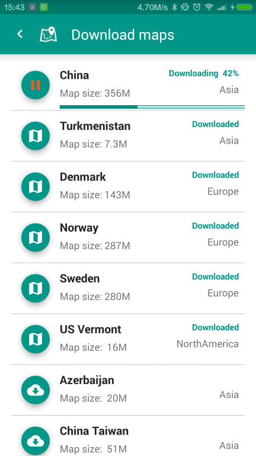
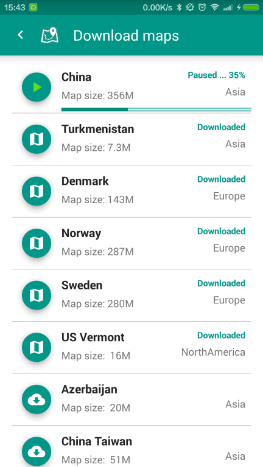
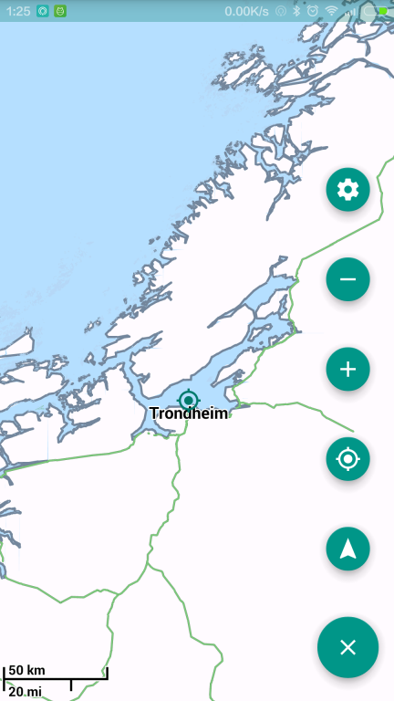
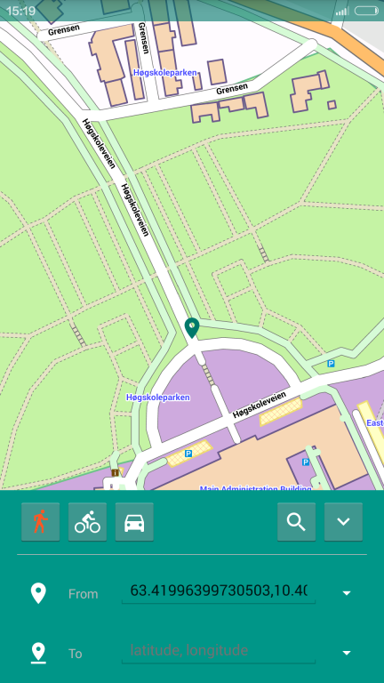
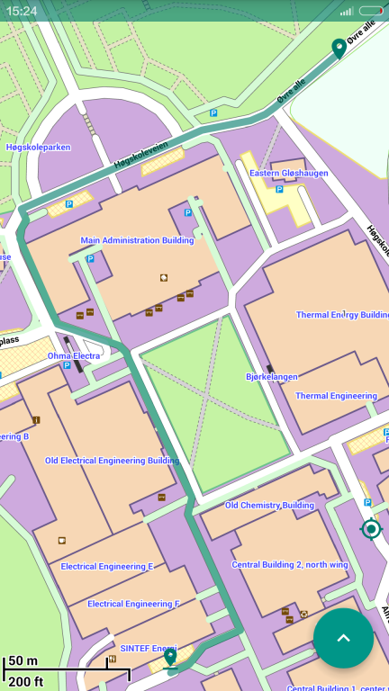
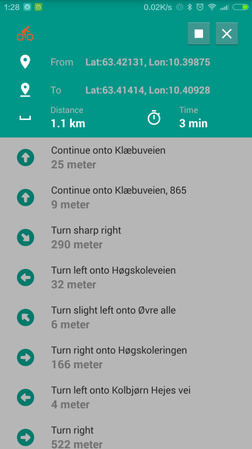
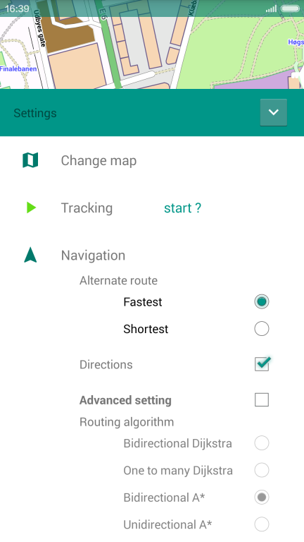
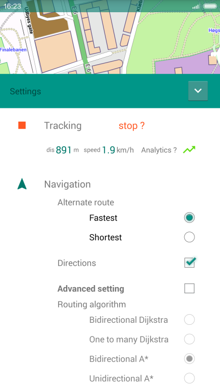
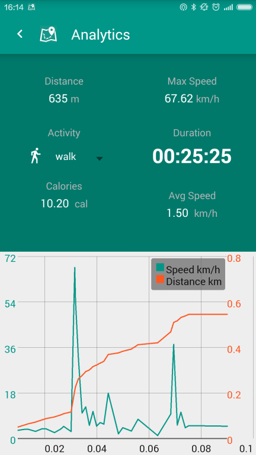

#PocketMaps 
Free offline maps with routing functions and more ...


This project uses [OSM](https://www.openstreetmap.org/) data, [Mapsforge](https://github.com/mapsforge/mapsforge)
and [Graphhopper](https://graphhopper.com/) open source API.

#[PocketMaps home page](http://junjunguo.com/PocketMaps/)

#[PocketMaps on Google Play](https://play.google.com/store/apps/details?id=com.junjunguo.pocketmaps)

#Screenshots
###resumable downloading
####downloading:


####paused:


###map view:


###search by coordinate:


###pathfinding:


###turn by turn navigation:


###setting:


###tracking: 


###sport analysis:


# Maps
##how to Create Maps

[read from source: (graphhopper)](https://github.com/graphhopper/graphhopper/blob/master/docs/android/index.md)

- Download the raw openstreetmap[OpenStreetMap Data Extracts](http://download.geofabrik.de/) file - to create the routing data
    - Execute ./graphhopper.sh import <your-osm-file>. This creates the routing data
- Download a map e.g. berlin.map [Mapsforge .map Download Server](http://download.mapsforge.org/)
- Copy berlin.map into the created berlin-gh folder
- Optional Compression Step: Bundle a graphhopper zip file via cd berlin-gh; zip -r berlin.ghz *
- Now copy the berlin-gh folder from step 4 (or the .ghz file from step 5) to your Android device.
    - /[download-folder]/graphhopper/maps, where the download-folder can e.g. be /mnt/sdcard/download or
/storage/sdcard/Download/ - e.g. use SSHDroid: scp -P 2222 berlin.ghz root@$URL:/mnt/sdcard/download/graphhopper/maps/


####for the current version please use [graphhoper 0.4.1](https://github.com/graphhopper/graphhopper/tree/0.4) with 'car, foot and bike' to generate maps

add this line to your graphhoper/config.properties to enable 'car, foot and bike':

```
 graph.flagEncoders=car,foot,bike
```

###[some of the created Maps](http://folk.ntnu.no/junjung/pocketmaps/maps/)

###Maps sources
####[Mapsforge .map Download Server](http://download.mapsforge.org/)
- [fast download mirror](http://ftp-stud.hs-esslingen.de/pub/Mirrors/download.mapsforge.org/maps/)

####[OpenStreetMap Data Extracts](http://download.geofabrik.de/)
- This server has data extracts from the OpenStreetMap project which are normally updated every day.


#License
[The MIT License (MIT)](LICENSE)
