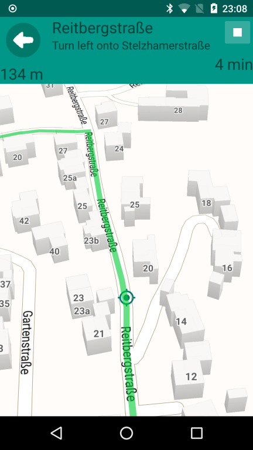

# PocketMaps
Free offline maps with routing functions and more ...

This project uses [OSM](https://www.openstreetmap.org/) data, [Mapsforge](https://github.com/mapsforge/mapsforge)
and [Graphhopper](https://graphhopper.com/) open source API.

* [PocketMaps home page](http://junjunguo.com/PocketMaps/)

# Screenshots
### resumable downloading
#### downloading: / paused:

### map view: / settings:

### search by coordinate: / pathfinding:

### turn by turn directions: / turn by turn navigation:

### tracking: / sport analysis:

# Maps
## how to Create Maps

[step by step discription](documentation/create_maps.md)

# License
[The MIT License (MIT)](LICENSE)
