UI Design
==

UI Implementation 
==

###prototype 1
- portrait
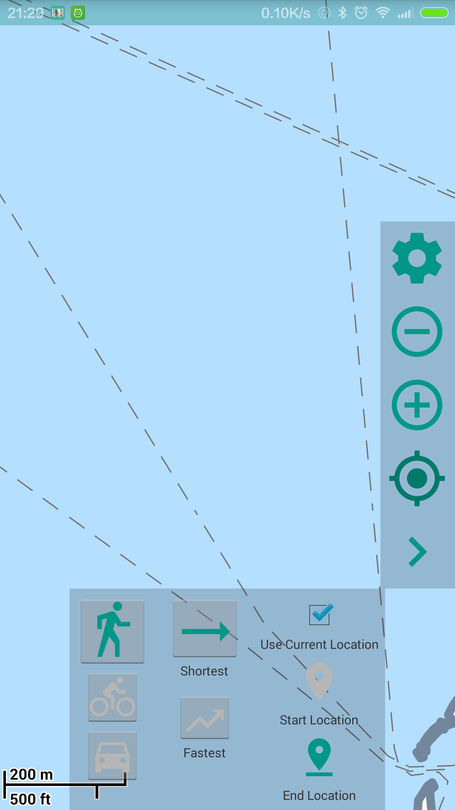
- landscape
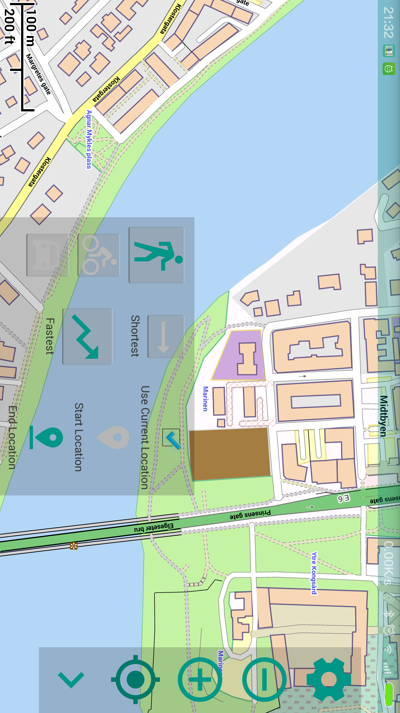
####update
- Material design: Floating Action button (idea)
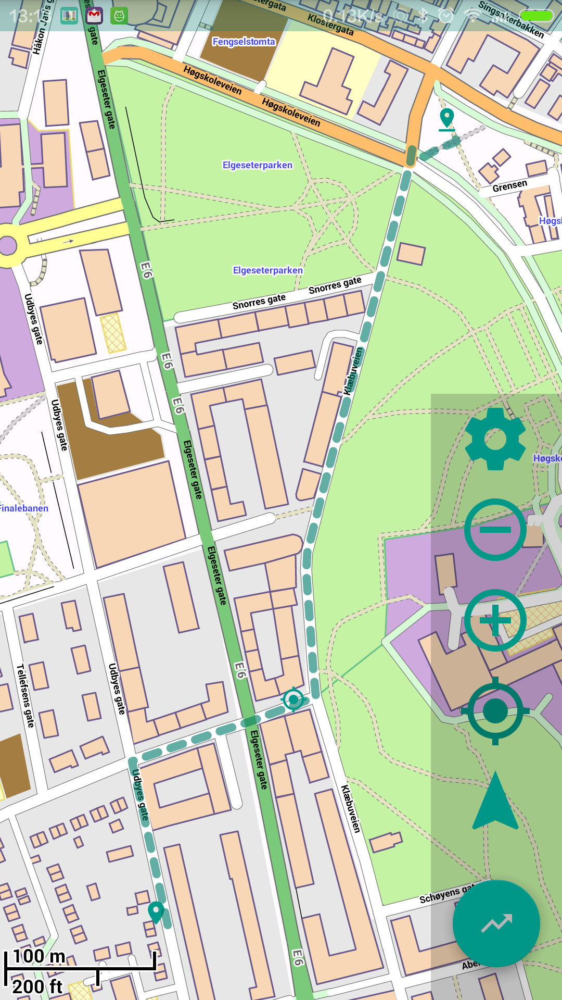
###prototype 2
- implement: Material design: use Floating Action button 

- navigation settings
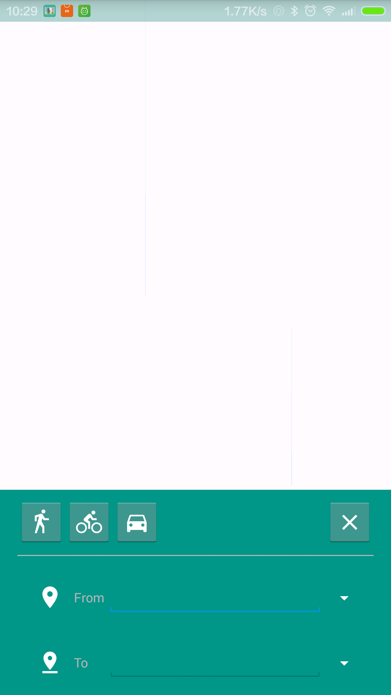
- navigation settings: dark header bar

###prototype 3
- improved main map
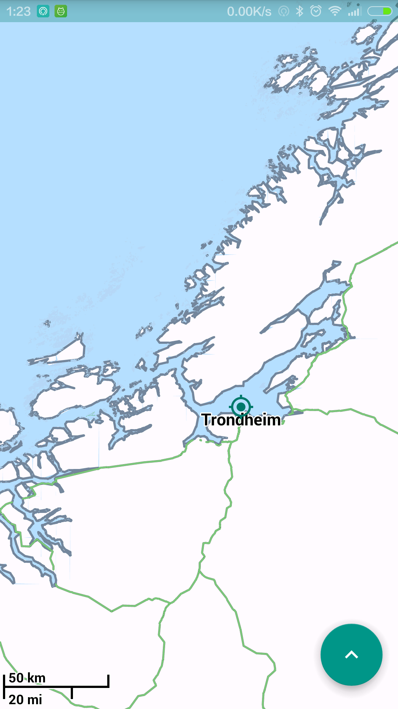
- show side bar menu

- navigation settings
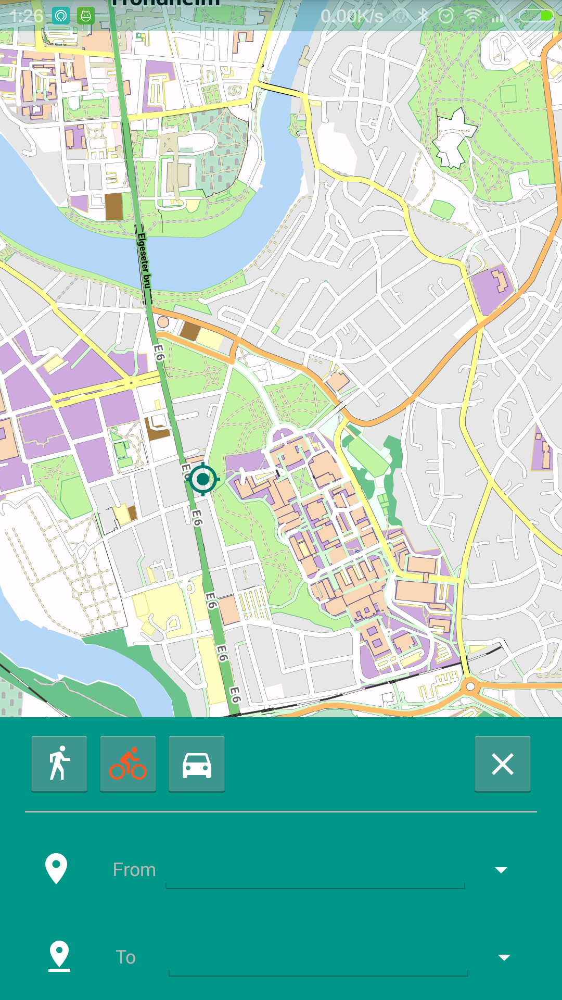
- navigation setting set from
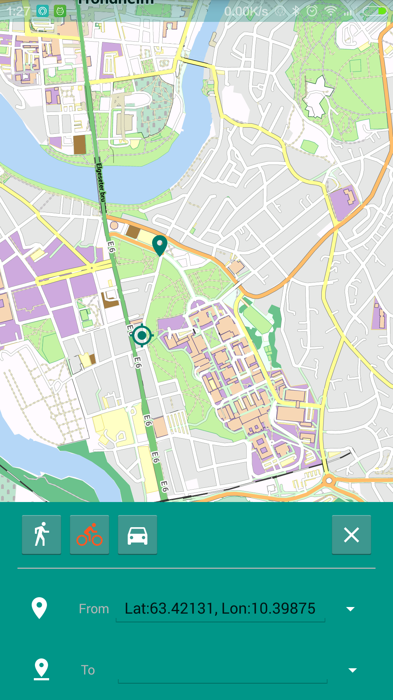
- navigation setting choose actions from To Location
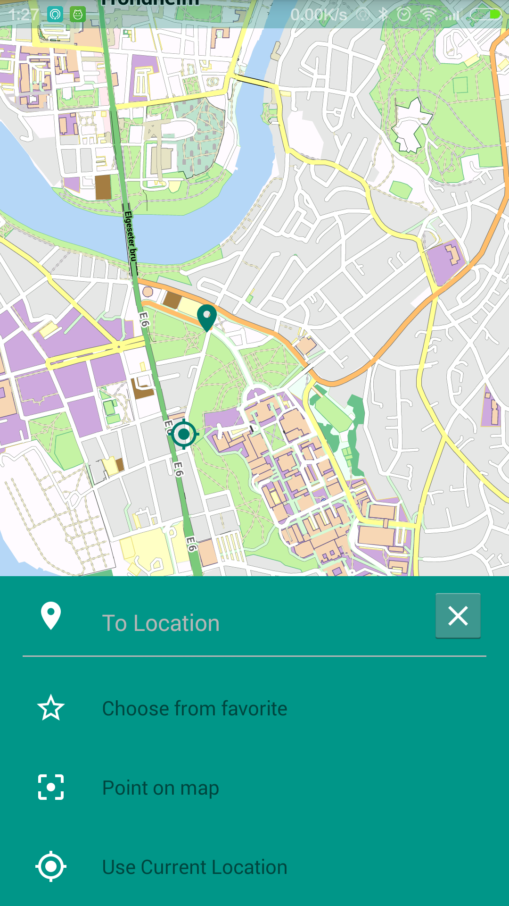
- directions view

- main map with side bar view
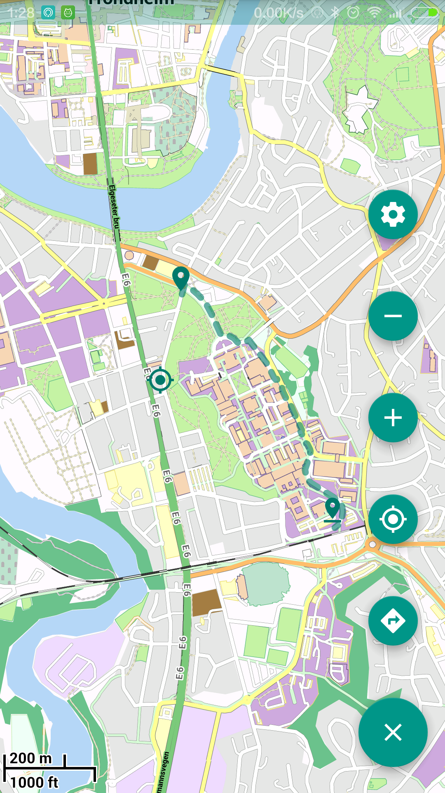
- stop navigation
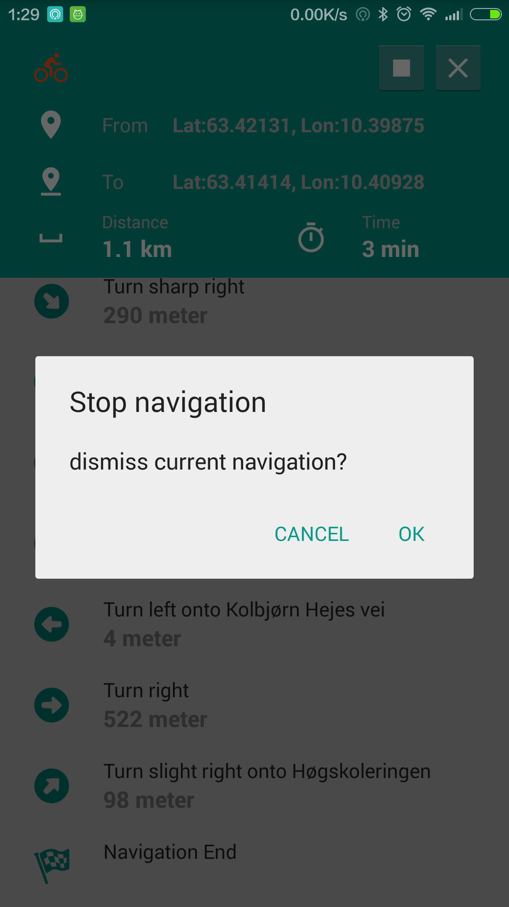
- app settings
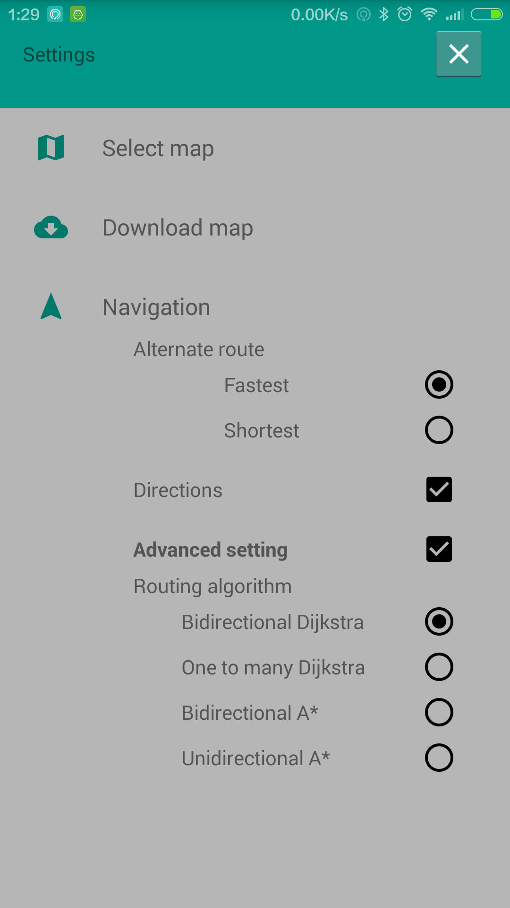
